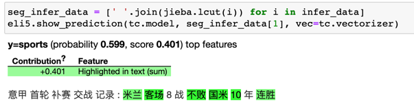

[](https://badge.fury.io/py/pytextclassifier)
[](https://pepy.tech/project/pytextclassifier)
[](CONTRIBUTING.md)
[](https://github.com/shibing624/pytextclassifier/graphs/contributors)
[](LICENSE)
[](requirements.txt)
[](https://github.com/shibing624/pytextclassifier/issues)
[](#Contact)

# PyTextClassifier
PyTextClassifier, Python Text Classifier. It can be applied to the fields of sentiment polarity analysis, text risk classification and so on,
and it supports multiple classification algorithms and clustering algorithms.

文本分类器，提供多种文本分类和聚类算法，支持文本极性情感分类，文本风险类型分类等文本分类和聚类应用，开箱即用。python3开发。


**Guide**

- [Feature](#Feature)
- [Install](#install)
- [Usage](#usage)
- [Dataset](#Dataset)
- [Contact](#Contact)
- [Citation](#Citation)
- [Reference](#reference)

# Feature

**pytextclassifier** is a python Open Source Toolkit for text classification. The goal is to implement
text analysis algorithm, so as to achieve the use in the production environment.

**pytextclassifier** has the characteristics
of clear algorithm, high performance and customizable corpus.

Functions：
### Classifier
  - [x] LogisticRegression
  - [x] Random Forest
  - [x] Decision Tree
  - [x] K-Nearest Neighbours
  - [x] Naive bayes
  - [x] Xgboost
  - [x] Support Vector Machine(SVM)
  - [x] TextCNN
  - [x] TextRNN_Att
  - [x] Fasttext
  - [x] BERT

### Cluster
  - [x] MiniBatchKmeans

While providing rich functions, **pytextclassifier** internal modules adhere to low coupling, model adherence to inert loading, dictionary publication, and easy to use.

# Install

- Requirements and Installation

```
pip3 install torch # conda install pytorch
pip3 install pytextclassifier
```

or

```
git clone https://github.com/shibing624/pytextclassifier.git
cd pytextclassifier
python3 setup.py install
```


# Usage
## Text Classifier

### English Text Classifier

Including model training, saving, predict, evaluate, for example [examples/base_demo.py](examples/base_demo.py):


```python
import sys

sys.path.append('..')
from pytextclassifier import ClassicClassifier

if __name__ == '__main__':
    m = ClassicClassifier(model_dir='models/lr', model_name_or_model='lr')
    # model_name is choose classifier, default lr, support lr, random_forest, decision_tree, knn, bayes, svm, xgboost
    print(m)
    data = [
        ('education', 'Student debt to cost Britain billions within decades'),
        ('education', 'Chinese education for TV experiment'),
        ('sports', 'Middle East and Asia boost investment in top level sports'),
        ('sports', 'Summit Series look launches HBO Canada sports doc series: Mudhar')
    ]
    # train and save best model
    m.train(data)
    # load best model from model_dir
    m.load_model()
    predict_label, predict_proba = m.predict([
        'Abbott government spends $8 million on higher education media blitz'])
    print(f'predict_label: {predict_label}, predict_proba: {predict_proba}')

    test_data = [
        ('education', 'Abbott government spends $8 million on higher education media blitz'),
        ('sports', 'Middle East and Asia boost investment in top level sports'),
    ]
    acc_score = m.evaluate_model(test_data)
    print(f'acc_score: {acc_score}')
```

output:

```
ClassicClassifier instance (LogisticRegression(fit_intercept=False), stopwords size: 2438)
predict_label: ['education'], predict_proba: [0.5378236358492112]
acc_score: 1.0
```

### Chinese Text Classifier(中文文本分类)

Text classification compatible with Chinese and English corpora.

example [examples/lr_classification_demo.py](examples/lr_classification_demo.py)

```python
import sys

sys.path.append('..')
from pytextclassifier import ClassicClassifier

if __name__ == '__main__':
    m = ClassicClassifier(model_dir='models/lr-toy', model_name_or_model='lr')
    # model_name is choose classifier, default lr, support lr, random_forest, textcnn, fasttext, textrnn_att, bert
    data = [
        ('education', '名师指导托福语法技巧：名词的复数形式'),
        ('education', '中国高考成绩海外认可 是“狼来了”吗？'),
        ('education', '公务员考虑越来越吃香，这是怎么回事？'),
        ('sports', '图文：法网孟菲尔斯苦战进16强 孟菲尔斯怒吼'),
        ('sports', '四川丹棱举行全国长距登山挑战赛 近万人参与'),
        ('sports', '米兰客场8战不败国米10年连胜'),
    ]
    m.train(data)
    print(m)
    # load best model from model_dir
    m.load_model()
    predict_label, predict_proba = m.predict(['福建春季公务员考试报名18日截止 2月6日考试',
                                              '意甲首轮补赛交战记录:米兰客场8战不败国米10年连胜'])
    print(f'predict_label: {predict_label}, predict_proba: {predict_proba}')

    test_data = [
        ('education', '福建春季公务员考试报名18日截止 2月6日考试'),
        ('sports', '意甲首轮补赛交战记录:米兰客场8战不败国米10年连胜'),
    ]
    acc_score = m.evaluate_model(test_data)
    print(f'acc_score: {acc_score}')  # 1.0

    #### train model with 1w data
    print('-' * 42)
    m = ClassicClassifier(model_dir='models/lr', model_name_or_model='lr')
    data_file = 'thucnews_train_1w.txt'
    m.train(data_file)
    m.load_model()
    predict_label, predict_proba = m.predict(
        ['顺义北京苏活88平米起精装房在售',
         '美EB-5项目“15日快速移民”将推迟'])
    print(f'predict_label: {predict_label}, predict_proba: {predict_proba}')
```

output:

```
ClassicClassifier instance (LogisticRegression(fit_intercept=False), stopwords size: 2438)
predict_label: ['education' 'sports'], predict_proba: [0.5, 0.598941806741534]
acc_score: 1.0
------------------------------------------
predict_label: ['realty' 'education'], predict_proba: [0.7302956923617372, 0.2565005445322923]
```

### Visual Feature Importance

Show feature weights of model, and prediction word weight, for example [examples/visual_feature_importance.ipynb](examples/visual_feature_importance.ipynb)
```python
import sys

sys.path.append('..')
from pytextclassifier import ClassicClassifier
import jieba

tc = ClassicClassifier(model_dir='models/lr-toy', model_name_or_model='lr')
data = [
    ('education', '名师指导托福语法技巧：名词的复数形式'),
    ('education', '中国高考成绩海外认可 是“狼来了”吗？'),
    ('sports', '图文：法网孟菲尔斯苦战进16强 孟菲尔斯怒吼'),
    ('sports', '四川丹棱举行全国长距登山挑战赛 近万人参与'),
    ('sports', '米兰客场8战不败国米10年连胜')
]
tc.train(data)
import eli5
infer_data = ['高考指导托福语法技巧国际认可',
              '意甲首轮补赛交战记录:米兰客场8战不败国米10年连胜']
eli5.show_weights(tc.model, vec=tc.feature)
seg_infer_data = [' '.join(jieba.lcut(i)) for i in infer_data]
eli5.show_prediction(tc.model, seg_infer_data[0], vec=tc.feature,
                     target_names=['education', 'sports'])
```

output:



### Deep Classification model

本项目支持多种常用深度分类模型，包括FastText、TextCNN、TextRNN、Bert分类模型。

- FastText 模型

训练和预测`FastText`模型示例[examples/fasttext_classification_demo.py](examples/fasttext_classification_demo.py)

```python
import sys

sys.path.append('..')
from pytextclassifier import FastTextClassifier, load_data

if __name__ == '__main__':
    m = FastTextClassifier(model_dir='models/fasttext-toy')
    data = [
        ('education', '名师指导托福语法技巧：名词的复数形式'),
        ('education', '中国高考成绩海外认可 是“狼来了”吗？'),
        ('education', '公务员考虑越来越吃香，这是怎么回事？'),
        ('sports', '图文：法网孟菲尔斯苦战进16强 孟菲尔斯怒吼'),
        ('sports', '四川丹棱举行全国长距登山挑战赛 近万人参与'),
        ('sports', '米兰客场8战不败保持连胜'),
    ]
    m.train(data, num_epochs=3)
    print(m)
    # load trained best model
    m.load_model()
    predict_label, predict_proba = m.predict(['福建春季公务员考试报名18日截止 2月6日考试',
                                              '意甲首轮补赛交战记录:米兰客场8战不败国米10年连胜'])
    print(f'predict_label: {predict_label}, predict_proba: {predict_proba}')
    test_data = [
        ('education', '福建春季公务员考试报名18日截止 2月6日考试'),
        ('sports', '意甲首轮补赛交战记录:米兰客场8战不败国米10年连胜'),
    ]
    acc_score = m.evaluate_model(test_data)
    print(f'acc_score: {acc_score}')  # 1.0

    #### train model with 1w data
    print('-' * 42)
    data_file = 'thucnews_train_1w.txt'
    m = FastTextClassifier(model_dir='models/fasttext')
    m.train(data_file, names=('labels', 'text'), num_epochs=3)
    # load best trained model from model_dir
    m.load_model()
    predict_label, predict_proba = m.predict(
        ['顺义北京苏活88平米起精装房在售',
         '美EB-5项目“15日快速移民”将推迟']
    )
    print(f'predict_label: {predict_label}, predict_proba: {predict_proba}')
    x, y, df = load_data(data_file)
    test_data = df[:100]
    acc_score = m.evaluate_model(test_data)
    print(f'acc_score: {acc_score}')
```

- BERT 类模型

训练和预测`BERT`模型，示例[examples/bert_classification_zh_demo.py](examples/bert_classification_zh_demo.py)

```python
import sys

sys.path.append('..')
from pytextclassifier import BertClassifier

if __name__ == '__main__':
    m = BertClassifier(model_dir='models/bert-chinese-toy', num_classes=2,
                       model_type='bert', model_name='bert-base-chinese', num_epochs=2)
    # model_type: support 'bert', 'albert', 'roberta', 'xlnet'
    # model_name: support 'bert-base-chinese', 'bert-base-cased', 'bert-base-multilingual-cased' ...
    data = [
        ('education', '名师指导托福语法技巧：名词的复数形式'),
        ('education', '中国高考成绩海外认可 是“狼来了”吗？'),
        ('education', '公务员考虑越来越吃香，这是怎么回事？'),
        ('sports', '图文：法网孟菲尔斯苦战进16强 孟菲尔斯怒吼'),
        ('sports', '四川丹棱举行全国长距登山挑战赛 近万人参与'),
        ('sports', '米兰客场8战不败国米10年连胜'),
    ]
    m.train(data)
    print(m)
    # load trained best model from model_dir
    m.load_model()
    predict_label, predict_proba = m.predict(['福建春季公务员考试报名18日截止 2月6日考试',
                                              '意甲首轮补赛交战记录:米兰客场8战不败国米10年连胜'])
    print(f'predict_label: {predict_label}, predict_proba: {predict_proba}')

    test_data = [
        ('education', '福建春季公务员考试报名18日截止 2月6日考试'),
        ('sports', '意甲首轮补赛交战记录:米兰客场8战不败国米10年连胜'),
    ]
    acc_score = m.evaluate_model(test_data)
    print(f'acc_score: {acc_score}')  # 1.0

    #### train model with 1w data file
    print('-' * 42)
    m = BertClassifier(model_dir='models/bert-chinese', num_classes=10,
                       model_type='bert', model_name='bert-base-chinese', num_epochs=2)
    data_file = 'thucnews_train_1w.txt'
    m.train(data_file)  # fine tune 2 轮
    m.load_model()
    predict_label, predict_proba = m.predict(
        ['顺义北京苏活88平米起精装房在售',
         '美EB-5项目“15日快速移民”将推迟'])
    print(f'predict_label: {predict_label}, predict_proba: {predict_proba}')
```


### Dataset

1. THUCNews中文文本数据集（1.56GB）：官方[下载地址](http://thuctc.thunlp.org/)。
2. 抽样的THUCNews中文文本10分类数据集（6MB），地址：[examples/thucnews_train_10w.txt](examples/thucnews_train_10w.txt)。

### Evaluate
各模型在THUCNews中文文本10分类数据集（6MB）的测试集评估，模型效果如下：

模型|acc|说明
--|--|--
LR|0.8803|逻辑回归Logistics Regression
TextCNN|0.8809|Kim 2014 经典的CNN文本分类
TextRNN_Att|0.9022|BiLSTM+Attention
FastText|0.9177|bow+bigram+trigram， 效果出奇的好
DPCNN|0.9125|深层金字塔CNN
Transformer|0.8991|效果较差
BERT|0.9483|bert + fc
ERNIE|0.9461|比bert略差

### 模型调研

提供分类模型快速调研工具，文件树：
```bash
pytextclassifier
├── bert_classifier.py
├── fasttext_classifier.py
├── classic_classifier.py
├── textcnn_classifier.py
└── textrnn_classifier.py
```

每个文件对应一个模型，各模型完全独立，可以直接运行，也方便修改，支持通过`argparse` 修改`--data_path`等参数。

直接在终端调用fasttext模型训练：
```bash
python -m pytextclassifier.fasttext_classifier -h
```

## Text Cluster


Text clustering, for example [examples/cluster_demo.py](examples/cluster_demo.py)
```python
import sys

sys.path.append('..')
from pytextclassifier.textcluster import TextCluster

if __name__ == '__main__':
    m = TextCluster(model_dir='models/cluster-toy', n_clusters=2)
    print(m)
    data = [
        'Student debt to cost Britain billions within decades',
        'Chinese education for TV experiment',
        'Abbott government spends $8 million on higher education',
        'Middle East and Asia boost investment in top level sports',
        'Summit Series look launches HBO Canada sports doc series: Mudhar'
    ]
    m.train(data)
    m.load_model()
    r = m.predict(['Abbott government spends $8 million on higher education media blitz',
                   'Middle East and Asia boost investment in top level sports'])
    print(r)

    ########### load chinese train data from 1w data file
    from sklearn.feature_extraction.text import TfidfVectorizer

    tcluster = TextCluster(model_dir='models/cluster', feature=TfidfVectorizer(ngram_range=(1, 2)), n_clusters=10)
    data = tcluster.load_file_data('thucnews_train_1w.txt', sep='\t', use_col=1)
    feature, labels = tcluster.train(data[:5000])
    tcluster.show_clusters(feature, labels, 'models/cluster/cluster_train_seg_samples.png')
    r = tcluster.predict(data[:30])
    print(r)
```

output:

```
TextCluster instance (MiniBatchKMeans(n_clusters=2, n_init=10), <pytextclassifier.utils.tokenizer.Tokenizer object at 0x7f80bd4682b0>, TfidfVectorizer(ngram_range=(1, 2)))
[1 1 1 1 1 1 1 1 1 1 1 8 1 1 1 1 1 1 1 1 1 1 9 1 1 8 1 1 9 1]
```
clustering plot image:


# Contact

- Issue(建议)：[](https://github.com/shibing624/pytextclassifier/issues)
- 邮件我：xuming: xuming624@qq.com
- 微信我：加我*微信号：xuming624*, 进Python-NLP交流群，备注：*姓名-公司名-NLP*


# Citation

如果你在研究中使用了pytextclassifier，请按如下格式引用：

APA:
```latex
Xu, M. Pytextclassifier: Text classifier toolkit for NLP (Version 1.2.0) [Computer software]. https://github.com/shibing624/pytextclassifier
```

BibTeX:
```latex
@software{Xu_Pytextclassifier_Text_classifier,
author = {Xu, Ming},
title = {Pytextclassifier: Text classifier toolkit for NLP},
url = {https://github.com/shibing624/pytextclassifier},
version = {1.2.0}
}
```


# License


授权协议为 [The Apache License 2.0](LICENSE)，可免费用做商业用途。请在产品说明中附加**pytextclassifier**的链接和授权协议。


# Contribute
项目代码还很粗糙，如果大家对代码有所改进，欢迎提交回本项目，在提交之前，注意以下两点：

 - 在`tests`添加相应的单元测试
 - 使用`python setup.py test`来运行所有单元测试，确保所有单测都是通过的

之后即可提交PR。


# Reference

- SentimentPolarityAnalysis
