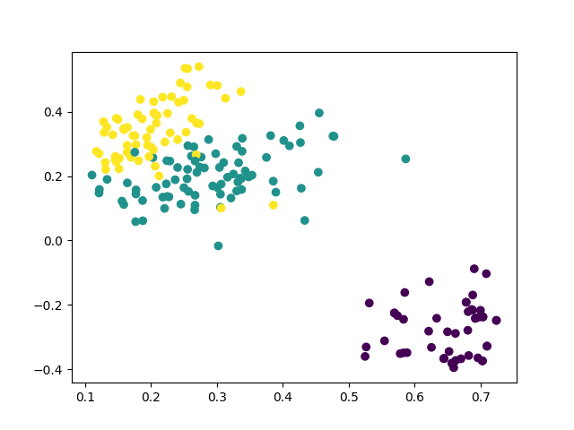

# pytextclassifier

[](https://badge.fury.io/py/pytextclassifier)
[](CONTRIBUTING.md)
[](https://github.com/shibing624/pytextclassifier/graphs/contributors)
[](LICENSE)
[](requirements.txt)
[](https://github.com/shibing624/pytextclassifier/issues)
[](#Contact)


pytextclassifier, Python Text Classifier. It can be applied to the fields of sentiment polarity analysis, text risk classification and so on,
and it supports multiple classification algorithms and clustering algorithms.

文本分类器，提供多种文本分类和聚类算法，支持文本极性情感分类，文本风险类型分类等文本分类和聚类应用。兼容python2.7和python3。


**Guide**

- [Feature](#Feature)
- [Install](#install)
- [Usage](#usage)
- [Dataset](#Dataset)
- [Contact](#Contact)
- [Cite](#Cite)
- [Reference](#reference)

# Feature

**pytextclassifier** is a python Open Source Toolkit for text classification. The goal is to implement
text analysis algorithm, so as to achieve the use in the production environment.

**pytextclassifier** has the characteristics
of clear algorithm, high performance and customizable corpus.

Functions：
### Classifier
  - [x] LogisticRegression
  - [x] Random Forest
  - [x] Decision Tree
  - [x] K-Nearest Neighbours
  - [x] Naive bayes
  - [x] Xgboost
  - [x] Support Vector Machine(SVM)
  - [x] Xgboost
  - [x] Xgboost_lr
  - [x] MLP
  - [x] Ensemble
  - [x] Stack
  - [x] TextCNN
  - [x] TextRNN
  - [x] Fasttext

### Evaluate
  - [x] Precision
  - [x] Recall
  - [x] F1

  
### Test
  - [x] Chi-square test
  
### Cluster
  - [x] MiniBatchKmeans

While providing rich functions, **pytextclassifier** internal modules adhere to low coupling, model adherence to inert loading, dictionary publication, and easy to use.

# Install

- Requirements and Installation


```
pip3 install pytextclassifier
```

or

```
git clone https://github.com/shibing624/pytextclassifier.git
cd pytextclassifier
python3 setup.py install
```


# Usage
### Text Classifier

- English Text Classifier

Including model training, saving, predict, test, for example [base_demo.py](examples/base_demo.py):


```python
from pytextclassifier import TextClassifier

m = TextClassifier(model_name='lr')
# model_name is choose classifier, support lr, random_forest, xgboost, svm, mlp, ensemble, stack
data = [
    ('education', 'Student debt to cost Britain billions within decades'),
    ('education', 'Chinese education for TV experiment'),
    ('sports', 'Middle East and Asia boost investment in top level sports'),
    ('sports', 'Summit Series look launches HBO Canada sports doc series: Mudhar')
]
m.train(data)
r = m.predict(['Abbott government spends $8 million on higher education media blitz',
               'Middle East and Asia boost investment in top level sports'])
print(r)  # ['education' 'sports']
m.save()
del m

new_m = TextClassifier()
new_m.load()
predict_label = new_m.predict(['Abbott government spends $8 million on higher education media blitz'])
print(predict_label)  # ['education']

predict_label = new_m.predict(['Abbott government spends $8 million on higher education media blitz',
                               'Middle East and Asia boost investment in top level sports'])
print(predict_label)  # ['education', 'sports']

test_data = [
    ('education', 'Abbott government spends $8 million on higher education media blitz'),
    ('sports', 'Middle East and Asia boost investment in top level sports'),
]
acc_score = new_m.test(test_data)
print(acc_score)  # 1.0
```

output:

```
['education' 'sports']
save output/vectorizer.pkl ok.
save output/model.pkl ok.
['education']
['education' 'sports']
1.0
```

- Chinese Text Classifier

Text classification compatible with Chinese and English corpora, for example [chinese_text_demo.py](examples/chinese_text_demo.py)

```python
from pytextclassifier import TextClassifier

m = TextClassifier(model_name='lr')
# model_name 是选择分类器，支持lr, random_forest, xgboost, svm, mlp, ensemble, stack
data = [
    ('education', '名师指导托福语法技巧：名词的复数形式'),
    ('education', '中国高考成绩海外认可 是“狼来了”吗？'),
    ('sports', '图文：法网孟菲尔斯苦战进16强 孟菲尔斯怒吼'),
    ('sports', '四川丹棱举行全国长距登山挑战赛 近万人参与'),
    ('sports', '米兰客场8战不败国米10年连胜')
]
m.train(data)

r = m.predict(['福建春季公务员考试报名18日截止 2月6日考试',
               '意甲首轮补赛交战记录:米兰客场8战不败国米10年连胜'])
print(r)  # ['education' 'sports']
m.save()
del m

new_m = TextClassifier()
new_m.load()
predict_label = new_m.predict(['福建春季公务员考试报名18日截止 2月6日考试'])
print(predict_label)  # ['education']

predict_label = new_m.predict(['福建春季公务员考试报名18日截止 2月6日考试',
                               '意甲首轮补赛交战记录:米兰客场8战不败国米10年连胜'])
print(predict_label)  # ['education', 'sports']

test_data = [
    ('education', '福建春季公务员考试报名18日截止 2月6日考试'),
    ('sports', '意甲首轮补赛交战记录:米兰客场8战不败国米10年连胜'),
]
acc_score = new_m.test(test_data)
print(acc_score)  # 1.0
```

output:

```
['education' 'sports']
save vectorizer.pkl ok.
save model.pkl ok.
['education']
['education' 'sports']
1.0
```
### Text Cluster


Text clustering, for example [cluster_demo.py](examples/cluster_demo.py)
```python

import sys

sys.path.append('..')
from pytextclassifier.textcluster import TextCluster

m = TextCluster()
data = [
    'Student debt to cost Britain billions within decades',
    'Chinese education for TV experiment',
    'Abbott government spends $8 million on higher education',
    'Middle East and Asia boost investment in top level sports',
    'Summit Series look launches HBO Canada sports doc series: Mudhar'
]
model, X_vec, labels = m.train(data, n_clusters=2)
r = m.predict(['Abbott government spends $8 million on higher education media blitz',
               'Middle East and Asia boost investment in top level sports'])
print(r)
m.show_clusters(X_vec, labels, image_file='cluster.png')
m.save()
del m

new_m = TextCluster()
new_m.load()
r = new_m.predict(['Abbott government spends $8 million on higher education media blitz',
                   'Middle East and Asia boost investment in top level sports'])
print(r)

# load train data from file
tc = TextCluster()
data = tc.load_file_data('train_seg_sample.txt')
_, X_vec, labels = tc.train(data, n_clusters=3)
tc.show_clusters(X_vec, labels, 'cluster_train_seg_samples.png')
r = tc.predict(data[:5])
print(r)
```

output:

```
[1 1]
[1 1]
[2 2 2 2 1]
```
clustering plot image:



### Train your Text Classification Deep Model

1. Preprocess with segment(optional)
```
cd pytextclassifier
python3 preprocess.py
```

2. Train model

you can change model with edit `config.py` and train model.
```
python3 train.py
```

3. Predict with test data
```
python3 infer.py
```


# Contact

- Issue(建议)：[](https://github.com/shibing624/pytextclassifier/issues)
- 邮件我：xuming: xuming624@qq.com
- 微信我：
加我*微信号：xuming624, 备注：个人名称-NLP* 进NLP交流群。


# Cite

如果你在研究中使用了pytextclassifier，请按如下格式引用：

```latex
@software{pytextclassifier,
  author = {Xu Ming},
  title = {pytextclassifier: A Tool for Text Classifier},
  year = {2021},
  url = {https://github.com/shibing624/pytextclassifier},
}
```

# License


授权协议为 [The Apache License 2.0](LICENSE)，可免费用做商业用途。请在产品说明中附加pytextclassifier的链接和授权协议。


# Contribute
项目代码还很粗糙，如果大家对代码有所改进，欢迎提交回本项目，在提交之前，注意以下两点：

 - 在`tests`添加相应的单元测试
 - 使用`python setup.py test`来运行所有单元测试，确保所有单测都是通过的

之后即可提交PR。


# Reference

- SentimentPolarityAnalysis
